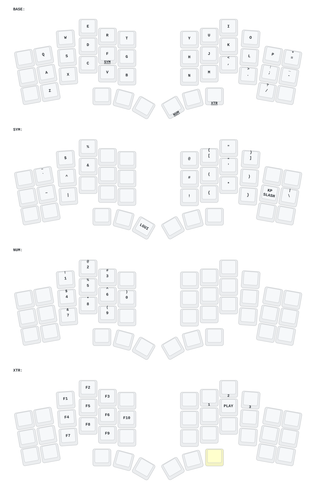

# Zenith Keyboard

ZMK firmware configuration for the Zenith.

Zenith is cool 6 columns version of the the TOTEM split keyboard, designed by the people at [ergo mech shop](https://ergomech.store/)

The controllers are the Seeeduino XIAO BLE (`nRF52840`) - I had no trouble pairing the halves with MacOS M series, Windows 11, and Arch Linux.

## Keymap Diagram

## Keyboard layout

| Layer    | Activation   | Description                                                  |
| -------- | ------------ | ------------------------------------------------------------ |
| **BASE** | Default      | QWERTY layout with modifiers                                 |
| **SYM**  | Hold `F`     | Symbols                                                      |
| **NUM**  | Hold `Enter` | Numbers and navigation                                       |
| **XTR**  | Hold `Tab`   | Extra layer with function keys, media and bluetooth controls |

- [Why this activation setup?](https://gist.github.com/pipegalera/96ebbe37e71e2c9030cf3b9d0725b4fb)
